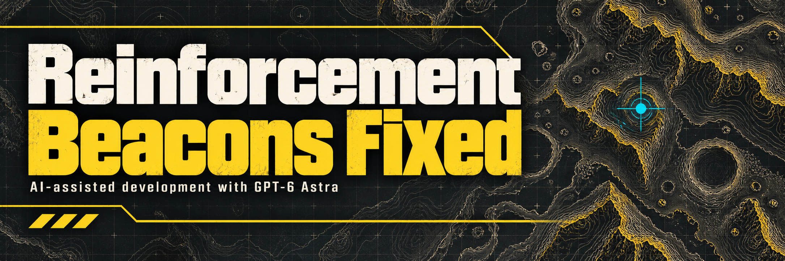

# Reinforcement Beacons Fixed

> [!IMPORTANT]
> **Bingus Shared Loader is now a separate required download.** [Download the latest loader](https://github.com/CowboyBingus/BingusSharedLoader/releases/latest), import `BingusSharedLoader.zip` into Arsenal or HD2MM, and enable it alongside Reinforcement Beacons Fixed before deploying. **This mod will not activate without the loader.** Mod managers do not install it automatically.
>
> **Arsenal (default priority): place Bingus Shared Loader LAST, at the bottom of the load order**, then **Purge → Deploy**. If you enabled first-mod priority, place the loader first instead.

[Download data-v3](https://github.com/CowboyBingus/ReinforcementBeaconsFixed/releases/tag/data-v3)

Centers your queued reinforcement pod over the selected beacon. Solo automatic reinforcements use the original position sampled when the automatic reinforcement begins.

**Install:** Close Helldivers 2. Import `BingusSharedLoader.zip` and `ReinforcementBeaconsFixed.zip` into **HDArsenal** or **HD2MM**, enable both, then deploy. When upgrading, replace the previous entries and **Purge → Deploy** to remove old installed archives. Use one manager. See [installation](INSTALL.txt).

This is the **data-v3 prerelease**, for Steam build **24826606** / EXE **1.8.45317.0**. It fixes an association failure involving teammate-owned beacons and retains startup recovery from data-v2.

Each diver needs the mod and loader on their own client. Installing it only on the host does not correct an unmodded teammate's pod.

## What it changes

The mod updates only your queued reinforcement X/Y in existing writable game data. It leaves launch height, countdown, beacon-use flags, other players and steering under game control. It neither patches executable instructions nor changes memory protection. Bingus Shared Loader owns startup; this package contains one gameplay Lua module.

Three prior live solo tests confirmed queue correction. The multiplayer repair passes synthetic regression tests, including the real data reader and update wrapper, but still needs installed multiplayer verification. A roughly 2–3 metre difference between the corrected queue and the near-ground player position remains unresolved. Exact ground landing is not guaranteed.

Initial drops and unsupported modes remain unchanged. Placement replaces the randomized result without running a second terrain-validation pass. The supported build is checked before activation.

## Compatibility

Bingus Shared Loader **loader-v2 or newer / API 1** is required. Its former name was Shared Mod Loader. The manager GUIDs and internal Lua resource names remain stable across the rename, allowing the current module-only Better Stratagem Bounce and Hellpod Steering Unlocked packages to coexist.

Remove previous Reinforcement Beacon Fix packages before installing this renamed release. The withdrawn native prototypes are excluded from this project and from the loader's registration list.

The runtime log is `%LOCALAPPDATA%/ReinforcementBeaconsFixed.log`. It reports the revision, correction count and last association. Share only the relevant error text when reporting a problem; raw captures are unnecessary.

## Source

- `src/`: the current data-only Lua implementation.
- `tests/`: synthetic startup, solo, teammate and write-boundary checks.
- `scripts/`: build and strict manager packaging.
- `assets/`: banner and square Arsenal artwork.

[Build instructions](CONTRIBUTING.md) · [Technical notes](docs/TECHNICAL.md) · [Third-party inputs](THIRD_PARTY.md) · [Release notes](docs/RELEASE_NOTES.md)

**AI disclosure:** GPT-6 Astra assisted with research, implementation, debugging, documentation and artwork.
